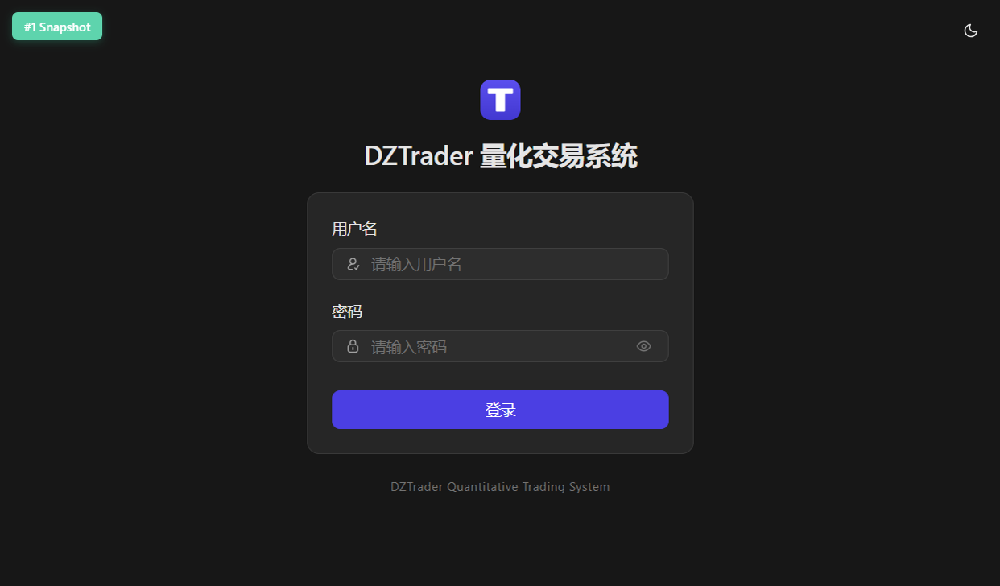
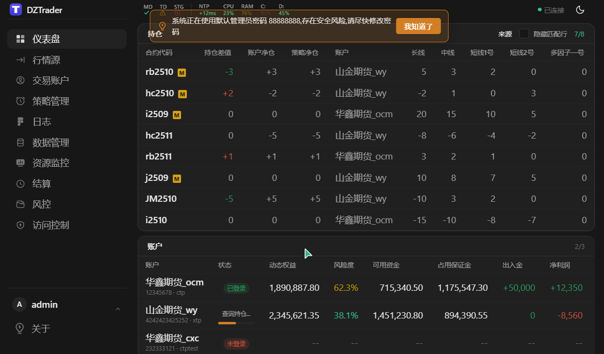
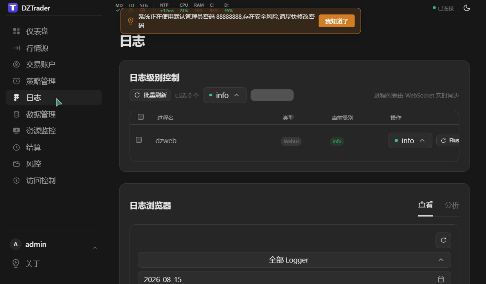

# dztrader

[](https://github.com/ockham001/dztrader/actions/workflows/ci.yml)

> 高性能量化交易系统，微秒级延迟，7×24 稳定运行，多进程架构 + 共享内存 IPC

> [!NOTE]
> 项目处于积极开发中（pre-1.0），API 与配置格式可能变化。欢迎 Star/Issue，但暂不建议生产使用。

## 特性

- **微秒级延迟**：行情到策略目标延迟 < 30μs
- **多进程架构**：一策略一进程，崩溃隔离
- **共享内存 IPC**：零拷贝进程间通信
- **多接口架构**：已实现 CTP（行情 + 交易）；XTP 等 20+ 券商 API 为规划项
- **C/C++ 策略接口**：C 接口保证 ABI 兼容，可直接用 C 开发；C++ 封装（提供工具、模板等）后期按需添加
- **Python 绑定**：pybind11，规划中（尚未实现）
- **7×24 运行**：健壮的进程管理、崩溃恢复、过期数据保护
- **跨平台**：Windows（MSVC 2022）和 Linux（GCC 12+）
- **前端**：WebUI 已实现（Vue3 + dzweb）；Qt 为规划项
- **C++20**：Concepts、Ranges、Format

## 界面预览

| 登录 | 仪表盘 | 日志 |
|---|---|---|
|  |  |  |

## 前置条件

| 依赖 | 版本 | 用途 |
| ------- | ------------------- | ----------- |
| CMake | 3.28+ | 构建系统 |
| Conan | 2.x | 包管理器 |
| Ninja | 任意 | 构建生成器（Windows + Linux 统一） |
| Visual Studio | 2022 | Windows MSVC 编译器（需 C++ 桌面开发工作负载，含 vcvarsall） |
| GCC | 12+ | Linux 编译器（C++20 支持） |
| Python | 3.9+ | pybind11 绑定（规划中，当前构建不需要） |
| Node.js | 18+ | 前端构建（仅开发期，运行时不需要） |

## 快速开始（4 命令工作流）

**唯一入口**，覆盖编译、调试、停止、清理。日常迭代只需要 4 个命令。

```bash
# Windows (PowerShell)
.\scripts\setup.ps1                    # 1. 装依赖 + configure（首次/改依赖时跑，写粘性 config）
.\scripts\build.ps1                    # 2. 构建（C++ + 前端 + dist 复制，一次搞定）
.\scripts\run-dev.ps1                  # 3. build + 设置 DZTRADER_HOME + 启动 master + 子进程
.\scripts\run-dev.ps1 -Stop            # 4. 停止（强杀 master + 清理僵尸子进程）
.\scripts\clean.ps1                    # （可选）清理所有 build 产物，保留 conan cache

# Linux (Bash)
./scripts/setup.sh release             # 1. 装依赖 + configure
./scripts/build.sh                     # 2. 构建
./scripts/run-dev.sh                   # 3. build + 启动 master + 子进程
                                       # 4. 停止: pkill dztraderd; pkill dzweb; pkill dzmd_ctp
./scripts/clean.sh                     # （可选）清理
# 浏览器访问 http://localhost:8080
```

### config 粘性

`setup` 决定 config，后续 `build`/`run-dev` 自动跟随：
- `.\scripts\setup.ps1` → 写 `.dztrader_dev/.config=Release`，后续默认 Release
- `.\scripts\setup.ps1 -Config Debug` → 写 `.dztrader_dev/.config=Debug`，后续默认 Debug
- 临时切 config：`.\scripts\build.ps1 -Config Debug`（不修改粘性文件）
- `clean` 会删 `.dztrader_dev/`（含粘性文件），下次 setup 后重新建立

### 命令详解

**setup** — `.\scripts\setup.ps1 [-Config Release|Debug] [-SkipConfigure]`
- 跑 conan install（装/编译依赖）+ cmake configure（生成 build.ninja）
- 首次/改 conanfile.py/改 CMakeLists.txt 配置层时跑
- 写 `.dztrader_dev/.config` 粘性文件
- Debug 时打印黄色警告

**build** — `.\scripts\build.ps1 [-Config Release|Debug] [-Target <name>]`
- config 来源：`-Config` 参数 > `.dztrader_dev/.config` > Release
- 构建 C++ + 前端（vite build）+ 复制 dist 到 `build/.../web/`
- 改任何代码（前端或后端）后跑这个，**禁止** `npm run build`
- `-Target dzmd_ctp` 只构建指定 target

**run-dev** — `.\scripts\run-dev.ps1 [-Stop] [-NoBuild] [-Config Release|Debug]`
- 默认含 build（先增量 build 再启动）
- 自动设置 `DZTRADER_HOME=.dztrader_dev`（避免污染生产配置）
- 启动 master（读 `$DZTRADER_HOME/configs/dztraderd.json`，缺失时自动生成默认配置；按其中 md/td 段自动拉起 dzweb + 网关等子进程）
- `-Stop`：强杀 master + `dztraderd --cleanup-orphans` 清理僵尸子进程
- `-NoBuild`：跳过 build 直接启动（快，但可能跑旧代码）
- Debug 时打印 `=== DEBUG BUILD - 仅本地调试，禁止部署生产 ===`

**clean** — `.\scripts\clean.ps1 [-IncludeNodeModules]`
- 删 `build/` + `apps/webui/frontend/dist/` + `.dztrader_dev/` + `compile_commands.json`
- 保留 `~/.conan2/`（conan cache，下次 setup 不重编依赖，省 20 分钟）
- `-IncludeNodeModules`：连 `frontend/node_modules/` 一起删

### 调试 Debug 流程

```bash
.\scripts\setup.ps1 -Config Debug      # 切到 Debug（一次性）
.\scripts\run-dev.ps1                  # build Debug + 启动（后续都自动 Debug）
# 改代码...
.\scripts\run-dev.ps1                  # 再跑一次，自动 build + 启动
.\scripts\run-dev.ps1 -Stop            # 停止

# 切回 Release
.\scripts\setup.ps1                    # 切到 Release
.\scripts\run-dev.ps1                  # 后续都自动 Release
```

### 防止 Debug 部署到生产

三层防护：
1. **路径分离**（结构性）：Debug 产物在 `build/.../Debug/`，Release 在 `build/.../Release/`，部署脚本从 Release 路径取
2. **Debug 警告**（视觉）：`run-dev` 启动 Debug 时打印黄色 `=== DEBUG BUILD - 仅本地调试，禁止部署生产 ===`
3. **install 脚本写死 Release**（流程强制，未来实现）：`cmake --install build/.../Release` 不接受 Debug 路径

**部署到生产**：永远从 `build/<plat>/<arch>/Release/` 复制，**绝不**从 Debug 复制。

## 策略示例（stg_demo）

`stg_demo`（`strategies/demo/`）是命令行示例策略，演示策略 SDK 的下单/撤单/行情订阅闭环。运行前提：dztraderd 已启动且 `DZTRADER_HOME` 指向同一运行目录。

```bash
stg_demo info                        # 策略身份 + SDK 版本（策略ID = 可执行文件名）
stg_demo order CTP001 IF2606 100 1   # 下限价开仓单并等回报（账户未连接 -> 拒单回报）
stg_demo md dzmd_ctp IF2606          # 订阅行情，观察 10s 打印 tick
stg_demo cancel CTP001 12345         # 发撤单请求
```

退出码供脚本/测试机器断言：`0` 成功 · `2` 用法/初始化错误 · `3` 下单被拒（空账户拒单闭环）· `4` 等待回报超时。由 master 托管运行时，在 `dztraderd.json` 的 `strategy` 段注册：`{"name": "stg_demo", "exe": "<绝对路径>/stg_demo", "args": ["info"]}`（`name` 必须与可执行文件名一致）。

## 安装与部署

### 本机安装

```bash
# Windows
cmake --install build/windows/x86_64/Release

# Linux
cmake --install build/linux/x86_64/Release
```

安装到 `install/<plat>/<arch>/<config>/`，与 build 同结构但无中间产物。

### 部署到其他电脑（Windows）

复制 `build/windows/x86_64/Release/` 整个目录到目标 Windows x64 机即可运行。
**不需要 npm/Node.js**，不需要 vcredist，不需要 nginx/apache：
- 静态 CRT（MT）→ 无运行时依赖
- boost/drogon/spdlog/sqlite 等静态链接进 exe
- dzweb.exe 自带 HTTP 服务器（drogon），托管 web/ 静态文件

目标机需要：
- Windows 10+ x64
- 数据目录（DZTRADER_HOME 或默认 ~/.dztrader/），内含 configs/

### 部署到其他电脑（Linux）

复制 `build/linux/x86_64/Release/` 整个目录到目标 Linux x64 机。
glibc 版本需 ≥ 构建机（或同等）。

## 常见问题

### npm not found / 前端未构建

前端构建需要 Node.js 18+。装好 Node 后重跑 `.\scripts\build.ps1`。
若 cmake configure 时报 "npm not found - frontend will not be built"，说明 npm 不在 PATH。

### 访问 5173 没反应 / 端口对不上

- **8080**：dzweb.exe 监听，生产/集成模式，永远访问这里
- **5173**：vite dev server 监听，仅 dev 模式（`cd apps/webui/frontend && npm run dev`）启用 HMR 热重载
- 用户验证 UI **永远访问 http://localhost:8080**

### 8080 端口被占用

检查 dzweb 进程：
- Windows: `Get-Process dzweb`
- Linux: `pgrep dzweb`

杀掉后重新 `run-dev.ps1`。若仍被占用，检查其他占用 8080 的程序。

### 改了前端但浏览器看不到变化

确认用的是 `build.ps1`（或 `build.sh`），**不是** `npm run build`。
直接 `npm run build` 的产物只在 `frontend/dist/`，dzweb 加载的是 `build/.../web/`。

### build/run-dev 跑了错的 config

检查 `.dztrader_dev/.config` 文件内容（`cat .dztrader_dev/.config`）。
- 想永久切：`.\scripts\setup.ps1 -Config Debug`（重写粘性文件）
- 想临时切：`.\scripts\build.ps1 -Config Debug`（不修改粘性文件，仅本次）
- 想重置：`.\scripts\clean.ps1` 删掉 `.dztrader_dev/`，下次 setup 重新建立

### DZTRADER_HOME 是什么

数据目录（配置、共享内存、日志）。
- `run-dev` 脚本自动指向项目内 `.dztrader_dev`（调试用，避免污染生产）
- 未设置时默认 `~/.dztrader/`
- 部署到其他电脑时，目标机需要设置此环境变量或用默认路径

## 贡献

欢迎贡献代码。请阅读 [CONTRIBUTING.md](CONTRIBUTING.md) 了解贡献指南。

## 许可证

MIT License。详见 [LICENSE](LICENSE)。

## 免责声明

本软件仅供教育和研究目的。交易涉及重大财务风险。作者不对任何交易损失负责。使用风险自负。
